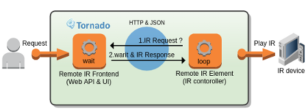

## Welcome to Remote IR Element

IR remocon agent application.

## Getting Started

1. Install Python(>2.7) pyserial:

        $ easy_install pip
        $ pip install pyserial

2. Start agent:

        $ python irelement.py

   Run with `--help` or `-h` for options

        $ python irelement.py -h
        usage: irelement.py [-h] [-s SERVER] [-p PORT] [-d IRDEV]
        remote IR agent

        optional arguments:
          -h, --help                  show this help message and exit
          -s SERVER, --server SERVER  WebAPI host
          -p PORT, --port PORT        WebAPI port
          -d IRDEV, --device IRDEV    device file to send IR

3. Using a browser, go to [Remote IR Frontend](https://github.com/netbuffalo/RemoteIRF) web UI (`http://localhost:8888/remocon/login`) and you'll see login page.

4. Follow the guidelines to use application.

    * [netbuffalo's blog](http://netbuffalo.doorblog.jp/archives/4873455.html)
    * [RemoteIRF](https://github.com/netbuffalo/RemoteIRF)

## License

Released under the [MIT License](http://www.opensource.org/licenses/MIT).

